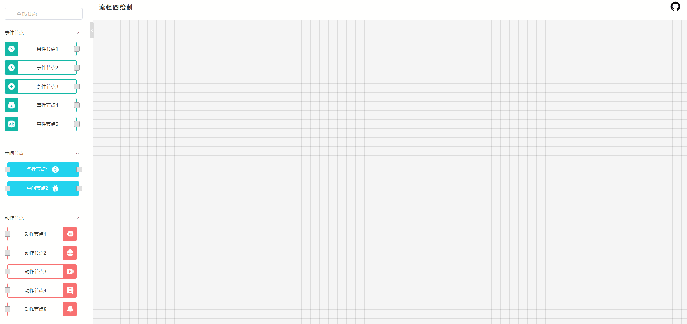

# 流程图项目

### [项目演示](https://fate-ui.github.io/flowChart/)

## 1. 项目介绍

类似于[node-red](https://github.com/node-red/node-red)、[ngx-flowchart](https://github.com/thingsboard/ngx-flowchart)
的流程图项目，目前已实现了以下功能(项目中部分功能参考于ngx-flowchart)：

✅ 向画布中添加节点及删除节点

✅ 节点的拖动

✅ 节点的连线

✅ 节点连线的编辑与删除

✅ 拖动时自动扩展画布尺寸

✅ 拖动触顶处理

✅ 节点表单数据验证与保存

✅ 节点框选功能

......等



## 2. 项目启动

1. 克隆代码

```bash
 git clone https://github.com/Fate-ui/flowChart.git
 cd flowChart
```

2. 安装依赖

项目是在pnpm下开发的，如果没有安装pnpm，可以使用npm或者yarn代替。如若报错，请[安装pnpm](https://www.pnpm.cn/installation)
后尝试。

```bash
 pnpm install
```

3. 启动项目

```bash
 pnpm run dev
```

4. 打包项目

```bash
 pnpm run build
```

## 3. 项目主要技术栈

#### vue3 + vite + typescript + pinia + element-plus + unocss + vueuse

## 4. 画布数据结构

```ts
export interface IFlow {
    nodes: INode[] // 节点
    connections: IConnect[] // 连线
    canvasSize: { width: number; height: number } // 画布尺寸
}


export interface INode<Params = any> {
    id: string // 前端根据uuid规则生成
    type: string // 节点类型
    params: Params // 存放每个节点的表单数据
    additional: { // 自定义参数
        layoutX: number // 节点在画布中的x坐标
        layoutY: number // 节点在画布中的y坐标
        showDrop?: boolean // 节点是否收缩
    }
}

export interface IConnect {
    fromId: string // 连线起点节点id
    toId: string  // 连线终点节点id
    from?: number // 连线起点index(方便后端直接使用数据)
    to?: number  // 连线终点index(方便后端直接使用数据)
    type: string // 连线类型
    id: string
    hidden?: boolean
}

```
