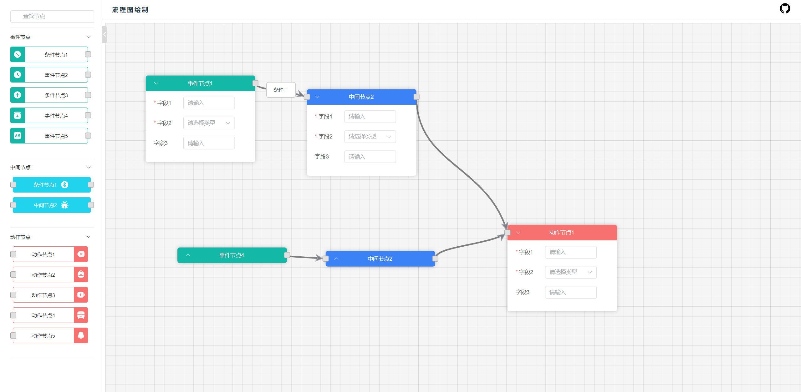

# 流程图项目

### [项目演示](https://fate-ui.github.io/flowChart/)

## 1. 项目介绍

类似于[node-red](https://github.com/node-red/node-red)、[ngx-flowchart](https://github.com/thingsboard/ngx-flowchart)
的流程图项目，目前已实现了以下功能(项目中部分功能参考于ngx-flowchart)：

- [x] 向画布中添加节点及删除节点
- [x] 节点的拖动
- [x] 节点的连线
- [x] 节点连线的编辑与删除
- [x] 拖动时自动扩展画布尺寸
- [x] 拖动触顶处理
- [x] 节点表单数据验证与保存
- [x] 节点框选功能

  ......等



## 2. 项目启动

1. 克隆代码

```bash
 git clone https://github.com/Fate-ui/flowChart.git
 cd flowChart
```

2. 安装依赖

项目是在pnpm下开发的，如果没有安装pnpm，可以使用npm或者yarn代替。如若报错，请尝试[安装pnpm](https://www.pnpm.cn/installation)
后尝试。

```bash
 pnpm install
```

3. 启动项目

```bash
 pnpm run dev
```

4. 打包项目

```bash
 pnpm run build
```

## 3. 项目主要技术栈

#### vue3 + vite + typescript + pinia + element-plus + unocss + vueuse
